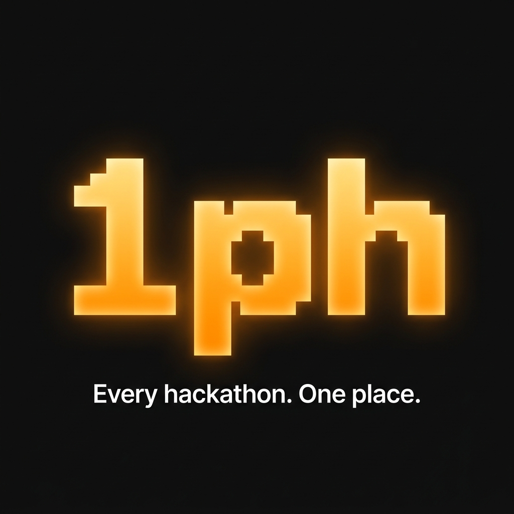

<div align="center">
  
</div>

<h1 align="center">1ph 🏆</h1>

<div align="center">

[Live Site](https://1ph.vercel.app) | [Architecture Docs](docs/architecture/system-design.md) | [GitHub](https://github.com/h55n/1ph)

[](https://1ph.vercel.app)
[](docs/architecture/system-design.md)
[](LICENSE)
[](https://nextjs.org/)
[](https://supabase.com)
[](https://github.com/h55n)

</div>

**The cleanest hackathon aggregator on the internet.** It's the only directory with a fully self-running AI pipeline — it scrapes 11+ sources every run, normalizes messy data, auto-assigns prestige tiers, enriches stub listings using Mistral AI, and sweeps out expired events. No ads, no noise, no manual curation. Switch between global prestige events and local India hackathons in one click. Built on Next.js 14 with a Supabase backend, deployed on Vercel, and runs a Python pipeline that just works.

---

## 📖 Table of Contents
- [Why 1ph?](#-why-1ph)
- [Features](#-features)
- [System Architecture](#-system-architecture)
- [Tech Stack](#-tech-stack)
- [Quick Start](#-quick-start)
- [Contributing](#-contributing)
- [License](#-license)

---

## ⚡ Why 1ph?

Finding high-quality hackathons is incredibly tedious. You have to scour Devfolio, MLH, HackerEarth, Dorahacks, and endless Twitter threads just to find one that matches your timeline.

**1ph solves this by centralizing everything.**
- **Zero Noise:** No ads, no sponsored bloat, no clutter. Just pure data.
- **AI-Enriched:** Our pipeline uses Mistral AI to extract real deadlines, prize pools, and descriptions from otherwise vague listings.
- **Prestige Sorted:** We automatically identify Tier 1 global hackathons and push them to the top.
- **Insanely Fast:** Built with Next.js 14 and static generation for near-instant load times.

## ✨ Features

- **Deep Filtering:** Filter by theme (AI, Web3, Fintech, etc.), mode (Online/Offline), entry fee, and team size.
- **Prestige Tiers:** Events are automatically assigned a prestige tier (T1, T2, T3) via our custom Tier Engine.
- **Status Tracking:** Instantly see what's Open, Closing Soon, or recently Closed.
- **Global + Local:** Seamlessly switch between global prestige events and region-specific hackathons (e.g., India).
- **Responsive UI:** A beautiful, dark-mode first design crafted for developers.

## 🏗 System Architecture

The 1ph ecosystem is broken into three distinct layers:
1. **Python AI Pipeline:** A highly concurrent scraping engine (`Playwright`, `HTTPX`) that pulls from 11+ sources, normalizes data, evaluates prestige, and uses Mistral AI to enrich metadata.
2. **Supabase PostgreSQL:** A robust relational database storing all normalized entities.
3. **Next.js Web App:** A lightning-fast frontend leveraging Prisma ORM to serve data to end-users.

👉 **View the full [System Architecture Diagrams & Documentation](docs/architecture/system-design.md)**

## 🛠 Tech Stack

| Domain | Technology |
|---|---|
| **Frontend** | Next.js 14 (App Router), React, Tailwind CSS |
| **Backend/DB** | Supabase (PostgreSQL), Prisma ORM |
| **Pipeline** | Python 3, Playwright, HTTPX, BeautifulSoup4 |
| **AI/ML** | Mistral AI API |
| **Deployment** | Vercel (Web), GitHub Actions (Pipeline) |

## 🚀 Quick Start

### 1. Clone & Install
```bash
git clone https://github.com/h55n/1ph.git
cd 1ph
npm install
```

### 2. Frontend Setup
Copy the environment variables and start the Next.js development server:
```bash
cp .env.example apps/web/.env.local
# Add your NEXT_PUBLIC_SUPABASE_URL and NEXT_PUBLIC_SUPABASE_ANON_KEY to .env.local
npm run dev
```
The app will be available at `http://localhost:3000`.

### 3. Pipeline Setup
To run the data collection pipeline locally:
```bash
cd pipeline
pip install -r requirements.txt
cp .env.example .env
# Add your DATABASE_URL and MISTRAL_API_KEY
python run.py
```

## 🤝 Contributing

We welcome contributions from the community! Whether you want to add a new hackathon source to the Python pipeline or improve the frontend UI, your help is appreciated.

1. Fork the Project
2. Create your Feature Branch (`git checkout -b feature/AmazingFeature`)
3. Commit your Changes (`git commit -m 'Add some AmazingFeature'`)
4. Push to the Branch (`git push origin feature/AmazingFeature`)
5. Open a Pull Request

## 📄 License

This project is licensed under the MIT License - see the [LICENSE](LICENSE) file for details.

---
<div align="center">
Made with ❤️ by <a href="https://github.com/h55n">hssn</a>
</div>
