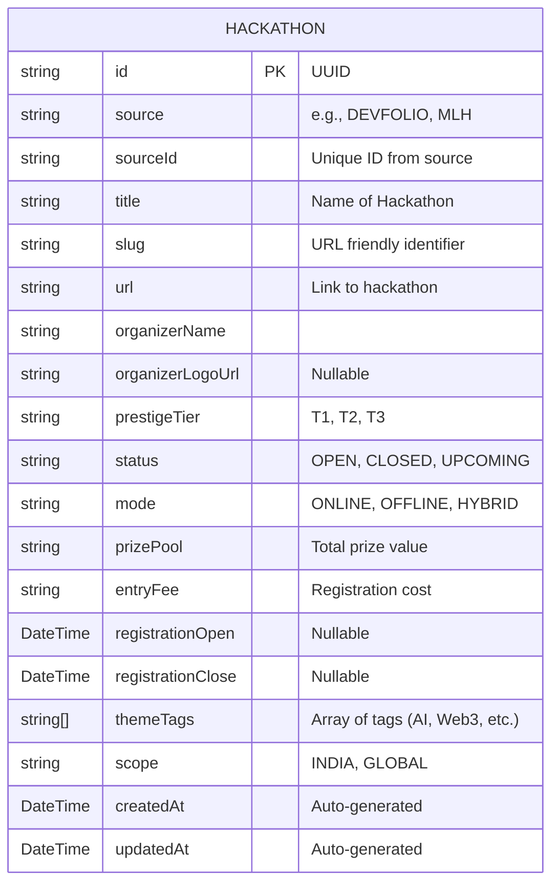

# 1ph System Architecture

This document outlines the high-level system architecture, data pipeline flow, and database schema for **1ph**. 

## 1. System Context Diagram

The 1ph system is composed of three main layers: the Python Data Pipeline (Backend), the PostgreSQL Database (Supabase), and the Next.js Web App (Frontend).

```mermaid
graph TD
    %% External Data Sources
    MLH[MLH] -->|Scraping| Pipeline
    Devfolio[Devfolio] -->|Scraping| Pipeline
    HackerEarth[HackerEarth] -->|Scraping| Pipeline
    Dorahacks[Dorahacks] -->|Scraping| Pipeline
    Luma[Luma] -->|Scraping| Pipeline
    
    %% Core System
    subgraph 1ph Ecosystem
        Pipeline[Python AI Data Pipeline\n(Scraping, Normalization, Enrichment)]
        DB[(Supabase PostgreSQL\nDatabase)]
        Web[Next.js 14 Web Application\n(Vercel)]
    end
    
    %% Internal Connections
    Pipeline -->|Upsert Hackathons via psycopg2| DB
    DB -->|Read Hackathons via Prisma| Web
    
    %% External AI
    Mistral[Mistral AI API] -.->|Enrichment| Pipeline
    
    %% End Users
    User((End User)) -->|View & Filter| Web
    
    classDef system fill:#f9f,stroke:#333,stroke-width:2px;
    classDef external fill:#eee,stroke:#333,stroke-width:1px;
    class Pipeline,DB,Web system;
    class MLH,Devfolio,HackerEarth,Dorahacks,Luma,Mistral external;
```

## 2. Python Data Pipeline Architecture

The backend pipeline is an orchestrated set of scripts that runs automatically to gather, parse, evaluate, enrich, and save hackathon data.

```mermaid
flowchart TD
    Start([Pipeline Start]) --> SourceIter[Iterate Sources\nMLH, Devfolio, etc.]
    
    SourceIter --> Fetch[1. Fetch / Scrape Data\n(Playwright / HTTPX)]
    Fetch --> Normalize[2. Normalization\nStandardize fields & formats]
    Normalize --> QG{3. Quality Gate}
    
    QG -->|Fails| Reject[Drop Record\nMissing deadline, spam, etc.]
    QG -->|Passes| TierEngine[4. Tier Engine\nAssign Prestige T1/T2/T3]
    
    TierEngine --> Upsert[(5. Initial DB Upsert\nSAVEPOINT Transactions)]
    
    Upsert --> EnrichmentPhase{Phase Complete?}
    EnrichmentPhase -->|No| SourceIter
    EnrichmentPhase -->|Yes| EnrichmentQueue[6. AI Enrichment\nQueue newly added items]
    
    EnrichmentQueue --> Mistral[Mistral LLM extraction:\nDeadlines, Prizes, Topics]
    Mistral --> FinalDB[(7. Final DB Update)]
    
    FinalDB --> Sweep[8. Status Sweep\nDelete expired hackathons]
    Sweep --> End([Pipeline Complete])
```

## 3. Database Schema (Prisma / Supabase)

The primary data model centers around the `Hackathon` entity.



## 4. Frontend Architecture (Next.js)

The frontend is built for extreme speed and simplicity, utilizing Server Components and Prisma.

- **Framework**: Next.js 14 App Router
- **Data Access**: Prisma ORM via `@/lib/db.ts`
- **Styling**: Tailwind CSS with custom thematic colors
- **Search & Filter**: URL-based query parameters enabling SSG/SSR hybrid caching.
- **Sorting Logic**: Hackathons are interleaved by prestige tier and deadlines to ensure maximum exposure of high-quality events across various sources natively on the homepage.
